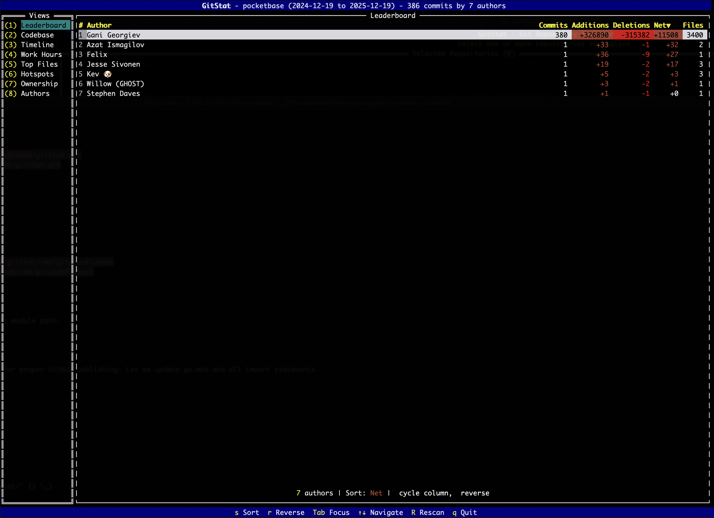
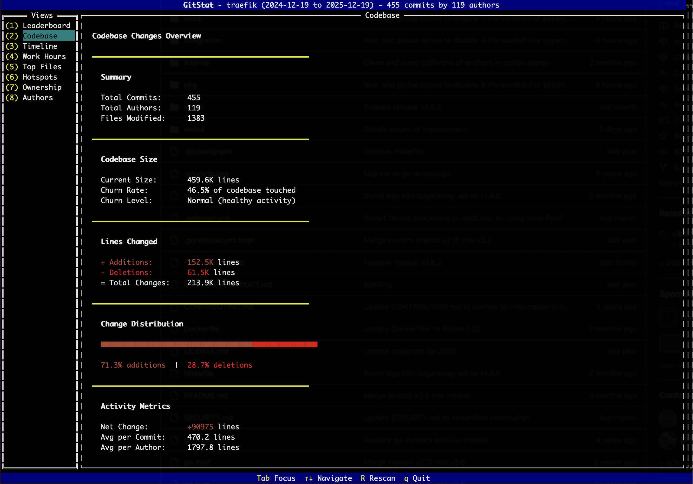
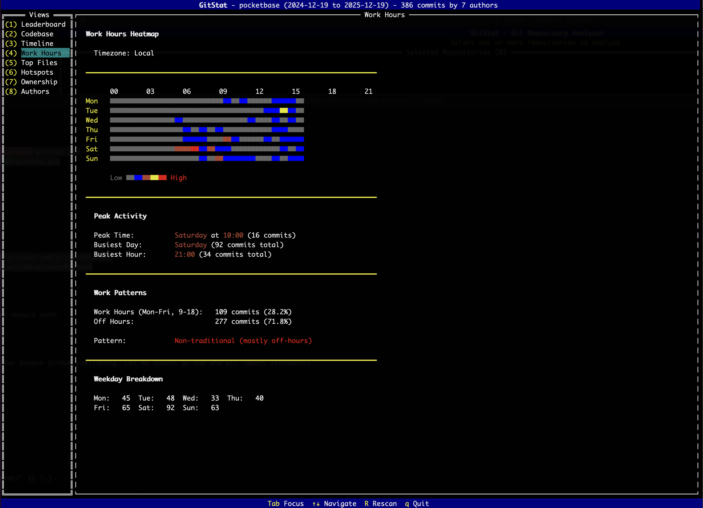

# GitStat

### A terminal-based Git repository statistics viewer built with Go and tview.

#### GitStat analyzes one or more Git repositories and displays comprehensive statistics through an interactive TUI with multiple views.

## Features

- **Multi-Repository Support**: Analyze multiple repositories with combined statistics
- **Author Leaderboard**: Rankings by commits, additions, deletions, and net lines
- **Codebase Overview**: Total changes, churn rate, and refactoring percentage
- **Timeline Sparklines**: Visual commit activity over time with rolling averages
- **Work Hours Heatmap**: When commits happen (day of week vs hour)
- **Top Changed Files**: Most modified files with change counts
- **Hotspots Detection**: High-risk files based on churn and contributor count
- **Ownership Analysis**: Directory ownership breakdown with bus factor estimation
- **Author Merging**: Combine multiple author identities into one

### Leaderboard View


### Codebase Overview


### Work Hours Heatmap
`


## Installation

### Prerequisites

- Go 1.21 or later ([download](https://go.dev/dl/))
- Git command-line tool

### From Source

```bash
# Clone the repository
git clone https://github.com/audi70r/gitstat.git
cd gitstat

# Download dependencies
go mod download

# Build the binary
go build -o gitstat ./cmd/gitstat

# Optional: Install to your PATH
go install ./cmd/gitstat
```

### Using go install

```bash
go install github.com/audi70r/gitstat/cmd/gitstat@latest
```

The binary will be installed to:
- `$GOBIN` if set
- `$GOPATH/bin` if `GOPATH` is set
- `$HOME/go/bin` by default (on Unix/macOS)
- `%USERPROFILE%\go\bin` by default (on Windows)

Make sure this directory is in your `PATH` to run `gitstat` from anywhere.

### Build Options

Build with optimizations:
```bash
go build -ldflags="-s -w" -o gitstat ./cmd/gitstat
```

Cross-compile for different platforms:
```bash
# Linux
GOOS=linux GOARCH=amd64 go build -o gitstat-linux ./cmd/gitstat

# Windows
GOOS=windows GOARCH=amd64 go build -o gitstat.exe ./cmd/gitstat

# macOS (Intel)
GOOS=darwin GOARCH=amd64 go build -o gitstat-darwin ./cmd/gitstat

# macOS (Apple Silicon)
GOOS=darwin GOARCH=arm64 go build -o gitstat-darwin-arm64 ./cmd/gitstat
```

### Running

```bash
# Run from current directory (will auto-detect if it's a git repo)
./gitstat

# Or if installed to PATH
gitstat
```

## Usage

Launch GitStat from any directory:

```bash
gitstat
```

### Setup Screen Controls

| Key | Action |
|-----|--------|
| `a` | Add repository |
| `d` | Remove selected repository |
| `s` | Edit Since date |
| `u` | Edit Until date |
| `Enter` | Start scanning |
| `Tab` | Switch focus |
| Arrow keys | Navigate |

### Repository Browser

| Key | Action |
|-----|--------|
| `Enter` | Open folder |
| `Space` | Add repository |
| `Esc` | Close browser |

### Main View Controls

| Key | Action |
|-----|--------|
| `Tab` | Switch focus (menu/view) |
| Arrow keys | Navigate |
| `1-8` | Quick switch to view |
| `R` | Rescan repositories |
| `q` | Quit |

### Sortable Views (Leaderboard, Files, Hotspots, Ownership)

| Key | Action |
|-----|--------|
| `s` | Cycle sort column |
| `r` | Reverse sort order |

### Authors View

| Key | Action |
|-----|--------|
| `Space` | Select author for batch merge |
| `m` | Merge selected authors |
| `a` | Apply pending merges |
| `c` | Clear all selections/merges |

## Views

### Leaderboard
Displays all contributors ranked by commits, with columns for additions, deletions, net lines, and files touched.

### Codebase
Shows overall statistics including total commits, additions, deletions, and estimates what percentage of the codebase was modified.

### Timeline
Sparkline visualization of commit activity over the selected date range, with rolling average calculation.

### Work Hours
Heatmap showing when commits occur, organized by day of week (rows) and hour of day (columns).

### Top Files
Lists the most frequently modified files with change counts, touch frequency, and contributor counts.

### Hotspots
Identifies high-risk files based on a combination of:
- Churn rate (how much the file changes)
- Touch frequency (how often it's modified)
- Contributor count (how many authors)

### Ownership
Shows directory-level ownership breakdown with:
- Visual ownership bars per contributor
- Bus factor estimation
- Ownership concentration analysis

### Authors
Lists all contributors with the ability to merge duplicate identities (e.g., when one person commits under different emails).

## Requirements

- Go 1.21 or later
- Git command-line tool

## Dependencies

- [tview](https://github.com/rivo/tview) - Terminal UI library
- [tcell](https://github.com/gdamore/tcell) - Terminal handling

## License

MIT License
